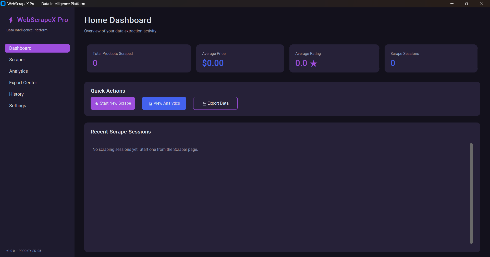
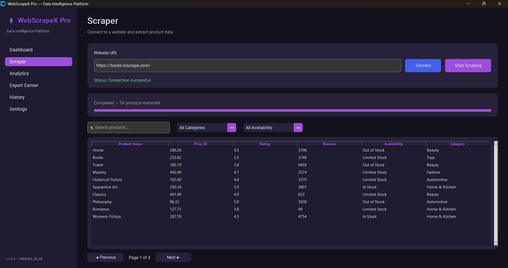
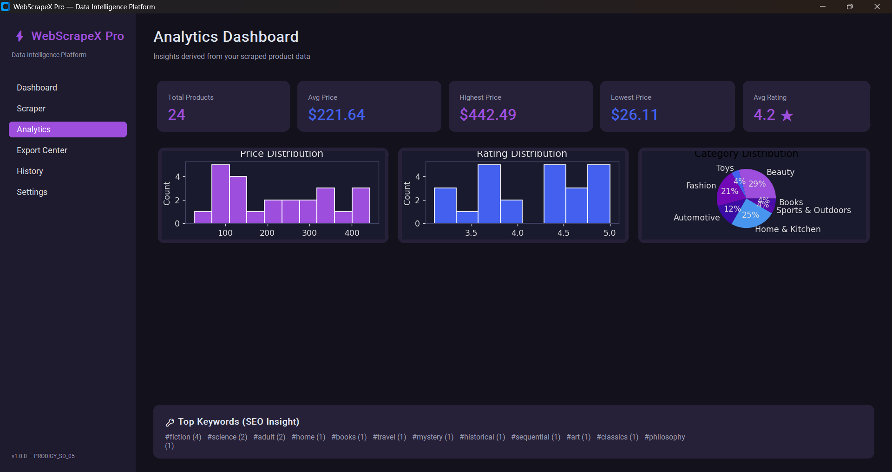
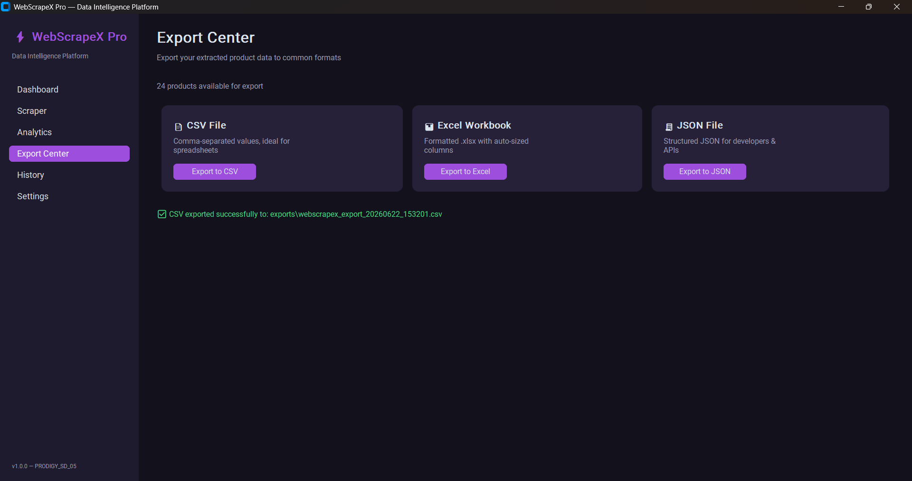
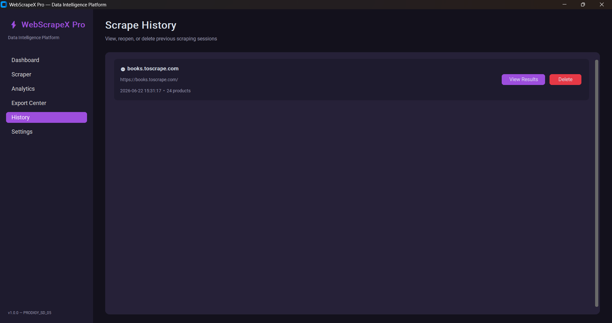
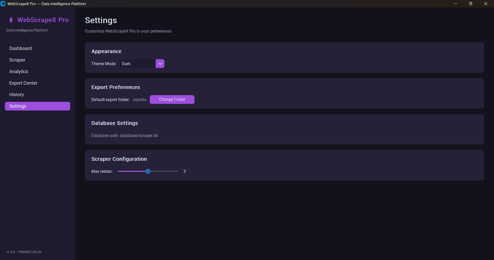

# ⚡ WebScrapeX Pro

### A Professional Data Extraction & Analytics Platform

WebScrapeX Pro is a desktop application that connects to e-commerce and product
listing websites, extracts structured product intelligence (names, prices,
ratings, reviews, availability, categories, and images), stores it in a local
SQLite database, and presents it through an analytics dashboard with
interactive charts — all wrapped in a modern dark/light themed CustomTkinter UI.

This project demonstrates a full data engineering pipeline: **extraction →
validation → storage → analysis → export**, structured using clean OOP and an
MVC-inspired architecture.

---

## 🚀 Features

### 🔌 Website Input & Connection
- URL input with live validation
- "Connect" button to test reachability before scraping
- Retry mechanism with configurable retry count
- Friendly error handling for unreachable / malformed URLs

### 🕸️ Product Extraction Engine
Extracts structured data per product:
- Product Name
- Price
- Rating
- Reviews Count
- Availability (In Stock / Out of Stock / Limited)
- Product Link
- Product Category
- Product Image URL

Runs on a **background thread** with a live progress bar so the UI never freezes.

### 📋 Interactive Data Table
- Sortable columns (click any header)
- Live search bar
- Category & availability filters
- Pagination (10 rows per page)

### 📤 Export Center
- CSV export
- Excel export (auto-sized columns via openpyxl)
- JSON export (pretty-printed)

### 🗄️ SQLite Database Layer
- Stores every scraping session (website name, URL, date, total products)
- Stores all extracted product records linked to sessions
- Session history with **view**, **reopen**, and **delete**

### 📊 Analytics Dashboard
- Total products scraped
- Average / highest / lowest price
- Average rating
- **Charts:** price distribution histogram, rating distribution histogram,
  category breakdown pie chart (Matplotlib, theme-aware)
- 🔑 Bonus: keyword extraction from product titles for SEO insight

### 🎨 Modern Dark / Light Theme
- Default dark theme: black background, purple + blue accents
- Light theme: clean modern white layout
- Switchable from the Settings page

### ⚙️ Settings
- Theme switching
- Default export folder
- Database path display
- Scraper retry configuration

---

## Screenshots

### Dashboard


### Scraper


### Analytics


### Export Center


### History


### Settings

---

## 🏗️ Architecture

```
┌─────────────────────────────────────────────────────────┐
│                        ui.py (View)                      │
│   Sidebar │ Dashboard │ Scraper │ Analytics │ Export │   │
│           History │ Settings — CustomTkinter             │
└───────────────┬───────────────────────────┬─────────────┘
                 │                           │
        ┌────────▼────────┐         ┌────────▼────────┐
        │   scraper.py     │         │  analytics.py   │
        │ Requests + BS4   │         │ Pandas+Matplotlib│
        │ Retry & Validate │         │ Stats & Charts   │
        └────────┬────────┘         └────────┬────────┘
                 │                            │
        ┌────────▼────────────────────────────▼────────┐
        │                 database.py                    │
        │            SQLite (sessions, products)         │
        └────────────────────┬───────────────────────────┘
                              │
                     ┌────────▼────────┐
                     │   exporter.py    │
                     │ CSV / Excel / JSON│
                     └──────────────────┘
```

**Pattern:** MVC-inspired
- **Model:** `database.py`, `scraper.py`, `analytics.py`, `exporter.py`
- **View / Controller:** `ui.py` (CustomTkinter pages + event handlers)
- **Entry Point:** `main.py`

---

## 📁 Project Structure

```
PRODIGY_SD_05/
│
├── main.py                # Application entry point
├── scraper.py              # Web scraping engine (requests + BS4)
├── database.py             # SQLite database manager
├── analytics.py            # Statistics + Matplotlib chart generation
├── exporter.py             # CSV / Excel / JSON export
├── ui.py                   # CustomTkinter UI (all pages)
│├── database/
│   └── scraper.db           # SQLite database (auto-created)
├── exports/                 # Exported data files (auto-created)
├── screenshots/             # App screenshots for README
│
├── README.md
├── requirements.txt
└── LICENSE
```

---

## 🛠️ Installation Guide

### Prerequisites
- Python 3.9+

### Steps

```bash
# 1. Clone the repository
git clone https://github.com/<your-username>/webscrapex-pro.git
cd webscrapex-pro

# 2. (Optional) Create a virtual environment
python -m venv venv
source venv/bin/activate      # On Windows: venv\Scripts\activate

# 3. Install dependencies
pip install -r requirements.txt

# 4. Run the application
python main.py
```

The SQLite database (`database/scraper.db`) and `exports/` folder are created
automatically on first run.

---

## 🧰 Tech Stack

| Layer | Technology |
|---|---|
| UI Framework | CustomTkinter |
| HTTP Requests | Requests |
| HTML Parsing | BeautifulSoup4 |
| Data Handling | Pandas |
| Database | SQLite3 |
| Excel Export | OpenPyXL |
| Charts | Matplotlib |
| Concurrency | Python `threading` |

---

## 🔮 Future Improvements

- [ ] Site-specific scraping profiles (Amazon, eBay, Flipkart adapters)
- [ ] Scheduled / automated recurring scrapes
- [ ] Price trend tracking over time with historical line charts
- [ ] Product comparison view (side-by-side)
- [ ] SEO metadata analysis (meta title/description extraction)
- [ ] Cloud sync / multi-user support with PostgreSQL backend
- [ ] Proxy rotation & headless browser support (Selenium/Playwright) for JS-heavy sites
- [ ] Notification system for price drop alerts

---

## 📄 License

This project is licensed under the MIT License — see [LICENSE](LICENSE) for details.

---

## 👤 Author

**Yoga Prabu E**

<p>GitHub: https://github.com/yoga-prabu2</p>
<p>LinkedIn: https://www.linkedin.com/in/yogaprabue07/</p>


Built as part of **Software Development Internship — Task 05**
